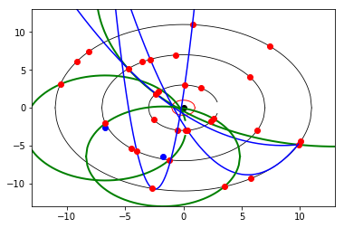

```python
import matplotlib.pyplot as plt
import numpy as np
from math import sqrt, isnan

def perpline(line, offset):
    x = offset[0] + line[0]/2 #midpoint x
    y = offset[1] + line[1]/2 #midpoint y
    if (line[0] != 0) and (line[1] != 0):
        g = -1 / (line[1] / float(line[0]))
    elif line[0] == 0:
        return 1, 0, y            #perpendicular line is horizontal: 1y = 0x + const
    else: #line[1] == 0
        return 0, 1, x           #perpendicular line is vertical: x = const + 0y --> 0y = x - const
    c = y - (g * x)
    return 1, g, c

def center(points):
    #unpack points
    a, b, c = points

    #find xy deltas of ab and cb
    ab = [a[0] - b[0], a[1] - b[1]]
    cb = [c[0] - b[0], c[1] - b[1]]

    #find perpendicular line from ab
    y, g1, c1 = perpline(ab, b)

    #find perpendicular line from cb
    y, g2, c2 = perpline(cb, b)

    #form and solve simultaneous equations
    #print("y = {}x + {}".format(g1, c1))
    #print("y = {}x + {}".format(g2, c2))
    A = np.array([[y,-g1],[y,-g2]])      #y = 0x + c
    B = np.array([c1, c2])
    try:
        C = np.linalg.solve(A,B)
    except:
        print("[INFO] No reasonable solution, or one or more linear equations were parallel to an axis.\n       Please use a different tracing method (parabola).")
        return "N/A", "N/A"
    #return solution
    if (isnan(C[0]) or isnan(C[1])): return "N/A", "N/A"
    y, x = C[0], C[1]
    return x, y

def plot(points, cen, r, a, b, c):
    if (r != "N/A"):
        plt.xlim(cen[0] - r-2, cen[0] + r + 2) #circle plus padding
        plt.ylim(cen[1] - r-2, cen[1] + r + 2) #circle plus padding
        plt.autoscale(False)
    #plot points
    plt.plot([x for x, y in points],
             [y for x, y in points], 'ro')
    
    #plot circle and center
    if (r != "N/A"):
        plt.plot([cen[0]], [cen[1]], 'ro', color="blue")

        xs = []; ys = []
        x = -r
        while x <= r:
            y = sqrt(r ** 2 - x ** 2)
            xs.append(x+cen[0]); ys.append(y+cen[1]);
            x += 0.1
        plt.plot(xs, ys, color="green")
        ys = [2*cen[1]-y for y in ys]
        plt.plot(xs, ys, color="green")
    plot_quadratic(a, b, c)
    plt.show()
    return

def circle(points):
    c = center(points)
    if c[0] == "N/A": return c #returns 2 x "N/A"
    r = sqrt((points[0][0] - c[0])**2 +
                  (points[0][1] - c[1])**2)
    return c, r

def quadratic(points):
        x0, y0 = points[0]
        x1, y1 = points[1]
        x2, y2 = points[2]

        x_2_coeff = ((y1-y2)*(x0-x1)-(y0-y1)*(x1-x2))/((x1**2 - x2**2)*(x0-x1) - (x0**2-x1**2)*(x1-x2))
        x_coeff = ((y1-y2)*(x0**2-x1**2)-(y0-y1)*(x1**2-x2**2))/((x0**2-x1**2)*(x1-x2)-(x1**2-x2**2)*(x0-x1))
        coeff_1   = x0*x1*y2/((-x0 + x2)*(-x1 + x2)) + x0*x2*y1/((-x0 + x1)*(x1 - x2)) + x1*x2*y0/((x0 - x1)*(x0 - x2))
        return x_2_coeff, x_coeff, coeff_1

def plot_quadratic(a,b,c):
    xs = []; ys = []
    x = -10
    while x <= 10:
        y = a * (x ** 2) + b * x + c
        xs.append(x); ys.append(y);
        x += 0.1
    plt.plot(xs, ys, color="blue")        
    return

if __name__ == "__main__":
    from random import uniform as rand
    for i in range(5): #how many to show (in series)
        points = ((rand(-10,10),rand(-10,10)),
                  (rand(-10,10),rand(-10,10)),
                  (rand(-10,10),rand(-10,10)))
        print("Points: "+str(points))
        cen, r = circle(points)
        print("Center: "+str(cen))
        print("Radius: "+str(r))
        a, b, c = quadratic(points)
        print("Quadratic: {}x^2+{}x+{}".format(a,b,c))  
        plot(points, cen, r, a, b, c)
        print("="*40)

```

    Points: ((-1.7427085921923346, -9.182150993823653), (2.0614928355345477, 5.042412398201531), (8.301109853121599, -8.683272284302486))
    Center: (2.975733286179632, -2.8230684494276193)
    Radius: 7.918435739842605
    Quadratic: -0.5913025988193992x^2+3.927669933441686x+-0.541561207602363





    ========================================
    Points: ((-0.6956753436643215, 9.668625745947885), (-8.349539467626334, -4.567408288034911), (5.090701731350599, 0.7702187037994594))
    Center: (-3.090609235839241, 1.780708952705973)
    Radius: 8.243478615547922
    Quadratic: -0.2528079698111683x^2+-0.426722413761848x+9.494115486868209


    ========================================
    Points: ((8.253297097017555, -1.291685980568321), (5.651554358162045, -6.347312347285605), (2.5910532417972263, -2.585449418950465))
    Center: (5.705304268938077, -3.1777014984826213)
    Radius: 3.1700665585690784
    Quadratic: 0.5602610842278507x^2+-5.847177948366613x+8.803555290686623


    ========================================
    Points: ((6.941295508396017, 7.461345825714048), (-1.1197741882078187, 0.24898741115447365), (0.3521692595817747, -1.0349315347639383))
    Center: (3.1188329529295653, 3.6226095049257414)
    Radius: 5.417297899182069
    Quadratic: 0.268165428271058x^2+-0.6664159514206441x+-0.8334990537418007
    ========================================
    Points: ((-5.820857788545412, 7.24999303878214), (0.05947647667905187, 9.545002703358492), (8.403256078597863, 9.91424029976556))
    Center: (5.207394896599501, -12.326008155386592)
    Radius: 22.468693331867378
    Quadratic: -0.024327177380254986x^2+0.2501274340681545x+9.530212061064065


    ========================================

