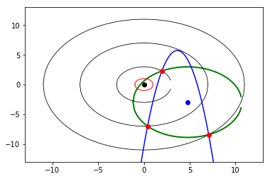
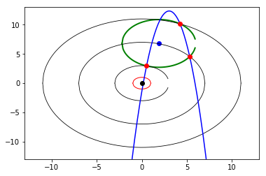

```python
import matplotlib.pyplot as plt
import numpy as np
from math import sqrt, isnan

def perpline(line, offset):
    x = offset[0] + line[0]/2 #midpoint x
    y = offset[1] + line[1]/2 #midpoint y
    if (line[0] != 0) and (line[1] != 0):
        g = -1 / (line[1] / float(line[0]))
    elif line[0] == 0:
        return 1, 0, y            #perpendicular line is horizontal: 1y = 0x + const
    else: #line[1] == 0
        return 0, 1, x           #perpendicular line is vertical: x = const + 0y --> 0y = x - const
    c = y - (g * x)
    return 1, g, c

def center(points):
    #unpack points
    a, b, c = points

    #find xy deltas of ab and cb
    ab = [a[0] - b[0], a[1] - b[1]]
    cb = [c[0] - b[0], c[1] - b[1]]

    #find perpendicular line from ab
    y, g1, c1 = perpline(ab, b)

    #find perpendicular line from cb
    y, g2, c2 = perpline(cb, b)

    #form and solve simultaneous equations
    #print("y = {}x + {}".format(g1, c1))
    #print("y = {}x + {}".format(g2, c2))
    A = np.array([[y,-g1],[y,-g2]])      #y = 0x + c
    B = np.array([c1, c2])
    try:
        C = np.linalg.solve(A,B)
    except:
        print("[INFO] No reasonable solution, or one or more linear equations were parallel to an axis.\n       Please use a different tracing method (parabola).")
        return "N/A", "N/A"
    #return solution
    if (isnan(C[0]) or isnan(C[1])): return "N/A", "N/A"
    y, x = C[0], C[1]
    return x, y

def plot(points, cen, r, a, b, c):
    if (r != "N/A"):
        plt.xlim(cen[0] - r-2, cen[0] + r + 2) #circle plus padding
        plt.ylim(cen[1] - r-2, cen[1] + r + 2) #circle plus padding
        plt.autoscale(False)
    #plot points
    plt.plot([x for x, y in points],
             [y for x, y in points], 'ro')
    
    #plot circle and center
    if (r != "N/A"):
        plt.plot([cen[0]], [cen[1]], 'ro', color="blue")

        xs = []; ys = []
        x = -r
        while x <= r:
            y = sqrt(r ** 2 - x ** 2)
            xs.append(x+cen[0]); ys.append(y+cen[1]);
            x += 0.1
        plt.plot(xs, ys, color="green")
        ys = [2*cen[1]-y for y in ys]
        plt.plot(xs, ys, color="green")
    plot_quadratic(a, b, c)
    plt.show()
    return

def circle(points):
    c = center(points)
    if c[0] == "N/A": return c #returns 2 x "N/A"
    r = sqrt((points[0][0] - c[0])**2 +
                  (points[0][1] - c[1])**2)
    return c, r

def quadratic(points):
        x0, y0 = points[0]
        x1, y1 = points[1]
        x2, y2 = points[2]

        x_2_coeff = ((y1-y2)*(x0-x1)-(y0-y1)*(x1-x2))/((x1**2 - x2**2)*(x0-x1) - (x0**2-x1**2)*(x1-x2))
        x_coeff = ((y1-y2)*(x0**2-x1**2)-(y0-y1)*(x1**2-x2**2))/((x0**2-x1**2)*(x1-x2)-(x1**2-x2**2)*(x0-x1))
        coeff_1   = x0*x1*y2/((-x0 + x2)*(-x1 + x2)) + x0*x2*y1/((-x0 + x1)*(x1 - x2)) + x1*x2*y0/((x0 - x1)*(x0 - x2))
        return x_2_coeff, x_coeff, coeff_1

def plot_quadratic(a,b,c):
    xs = []; ys = []
    x = -10
    while x <= 10:
        y = a * (x ** 2) + b * x + c
        xs.append(x); ys.append(y);
        x += 0.1
    plt.plot(xs, ys, color="blue")        
    return

if __name__ == "__main__":
    from random import uniform as rand
    for i in range(5): #how many to show (in series)
        print("="*40)
        points = ((rand(-10,10),rand(-10,10)),
                  (rand(-10,10),rand(-10,10)),
                  (rand(-10,10),rand(-10,10)))
        print("Points: "+str(points))
        cen, r = circle(points)
        print("Center: "+str(cen))
        print("Radius: "+str(r))
        a, b, c = quadratic(points)
        print("Approx. quadratic equation: {}x^2+{}x+{}".format(round(a,2),round(b,2),round(c,2)))  
        plot(points, cen, r, a, b, c)

```

    ========================================
    Points: ((7.6108989105313825, 9.214517013713536), (-2.7531581756468837, 2.3335015453326236), (0.49648230279160366, -3.937366642695846))
    Center: (4.766633714274075, 2.2529137534522503)
    Radius: 7.520223697465466
    Approx. quadratic equation: 0.36x^2+-1.11x+-3.48


    ========================================
    Points: ((7.999371175378258, -1.2845517181872363), (-1.1430719461633174, 3.6872871732936936), (-1.966592653023163, 6.920611566044922))
    Center: (6.819081364625115, 7.436767009433732)
    Radius: 8.80082293800528
    Approx. quadratic equation: 0.34x^2+-2.87x+-0.04





    ========================================
    Points: ((8.218981057736052, -3.3342046937055203), (4.28972617025611, 6.760352896009888), (-1.4979977611907547, -6.793526420657329))
    Center: (1.5936946685927742, -0.10106354453926458)
    Radius: 7.3720839271266625
    Approx. quadratic equation: -0.51x^2+3.75x+-0.04


    ========================================
    Points: ((8.31053018031756, -4.382257810924697), (2.5799716505518298, 9.908080227350986), (-2.4787082479737705, 1.3629031516230032))
    Center: (5.121995577192889, 2.6332828095781875)
    Radius: 7.706138015455562
    Approx. quadratic equation: -0.39x^2+1.73x+8.03


    ========================================
    Points: ((9.680052565888502, -3.0211663072216215), (-7.816288575673688, 5.9223945818482555), (5.2136341945094, 2.945665210470832))
    Center: (-4.338250417108895, -8.859377116621115)
    Radius: 15.185437892207878
    Approx. quadratic equation: -0.06x^2+-0.39x+6.72




