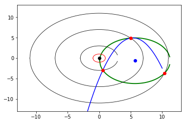

```python
import matplotlib.pyplot as plt
import numpy as np
from math import sqrt, isnan
from random import uniform, randint

def gen_circle_points(radii, num_sets):
        points_list = []

        for i in range(num_sets):
            points = []
            
            for r in radii:
                a = randint(0,1)
                x = uniform(0,r)
                y = sqrt(r**2 - x**2)
                if a == 0: y = -y
                points.append((x,y))
                
            points_list.append(points)
        return points_list
    
def perpline(line, offset):
    x = offset[0] + line[0]/2 #midpoint x
    y = offset[1] + line[1]/2 #midpoint y
    if (line[0] != 0) and (line[1] != 0):
        g = -1 / (line[1] / float(line[0]))
    elif line[0] == 0:
        return 1, 0, y            #perpendicular line is horizontal: 1y = 0x + const
    else: #line[1] == 0
        return 0, 1, x           #perpendicular line is vertical: x = const + 0y --> 0y = x - const
    c = y - (g * x)
    return 1, g, c

def center(points):
    #unpack points
    a, b, c = points

    #find xy deltas of ab and cb
    ab = [a[0] - b[0], a[1] - b[1]]
    cb = [c[0] - b[0], c[1] - b[1]]

    #find perpendicular line from ab
    y, g1, c1 = perpline(ab, b)

    #find perpendicular line from cb
    y, g2, c2 = perpline(cb, b)

    #form and solve simultaneous equations
    A = np.array([[y,-g1],[y,-g2]])
    B = np.array([c1, c2])
    try:
        C = np.linalg.solve(A,B)
    except:
        print("[WARN] Lines do not converge, no real solution by this method.\n       Please use a different tracing method (parabola).")
        return "N/A", "N/A"
    #return solution
    if (isnan(C[0]) or isnan(C[1])): return "N/A", "N/A"
    y, x = C[0], C[1]
    return x, y

def plot_circle(r, cx, cy, color, lw=2):
    xs = []; ys = []
    x = -r
    while x <= r:
       y = sqrt(r ** 2 - x ** 2)
       xs.append(x+cx); ys.append(y+cy);
       x += 0.1
    plt.plot(xs, ys, color=color, linewidth=lw)
    ys = [2*cy - y for y in ys]
    plt.plot(xs, ys, color=color, linewidth=lw)

def plot(points, cen, r, a, b, c, radii):
    if (r != "N/A"):
        plt.xlim(cen[0] - r-2, cen[0] + r + 2) #circle plus padding
        plt.ylim(cen[1] - r-2, cen[1] + r + 2) #circle plus padding
        plt.autoscale(False)
            
    #plot circle and center
    if (r != "N/A"):
        plt.plot([cen[0]], [cen[1]], 'ro', color="blue")
        plot_circle(r, cen[0], cen[1], "green")
      
    #plot 'detector' rings
    for r in radii:
        plot_circle(r, 0, 0, "black", lw=0.8)
        
    #plot the quadratic    
    plot_quadratic(a, b, c)
    
    #plot points
    plt.plot([x for x, y in points],
             [y for x, y in points], 'ro', color="red")
    
    plt.show()
    return

def circle(points):
    c = center(points)
    if c[0] == "N/A": return c #returns 2 x "N/A"
    r = sqrt((points[0][0] - c[0])**2 +
                  (points[0][1] - c[1])**2)
    return c, r

def quadratic(points):
        x0, y0 = points[0]
        x1, y1 = points[1]
        x2, y2 = points[2]

        x_2_coeff = ((y1-y2)*(x0-x1)-(y0-y1)*(x1-x2))/((x1**2 - x2**2)*(x0-x1) - (x0**2-x1**2)*(x1-x2))
        x_coeff = ((y1-y2)*(x0**2-x1**2)-(y0-y1)*(x1**2-x2**2))/((x0**2-x1**2)*(x1-x2)-(x1**2-x2**2)*(x0-x1))
        coeff_1   = x0*x1*y2/((-x0 + x2)*(-x1 + x2)) + x0*x2*y1/((-x0 + x1)*(x1 - x2)) + x1*x2*y0/((x0 - x1)*(x0 - x2))
        return x_2_coeff, x_coeff, coeff_1

def plot_quadratic(a,b,c):
    xs = []; ys = []
    x = -10
    while x <= 10:
        y = a * (x ** 2) + b * x + c
        xs.append(x); ys.append(y);
        x += 0.1
    plt.plot(xs, ys, color="blue")
    return

if __name__ == "__main__":
    print("="*40)
    radii = (3, 7, 11)
    acc = 2 #accuracy of output
    for i in range(3): #how many to show (in series)
        points = gen_circle_points(radii,1)[0]
        rounded_points = [(round(point[0], acc), round(point[1],acc)) for point in points]
        print("Points: "+str(rounded_points))
        cen, r = circle(points)
        print("Center: ({},{})".format(round(cen[0],acc),round(cen[1],acc)))
        print("Radius: "+str(round(r,acc)))
        a, b, c = quadratic(points)
        print("Quadratic: {}x^2+{}x+{}".format(round(a,acc),round(b,acc),round(c,acc)))
        plot(points, cen, r, a, b, c, radii)
        print("="*40)
```

    ========================================
    Points: [(0.51, 2.96), (2.3, 6.61), (6.74, 8.7)]
    Center: (7.19,1.96)
    Radius: 6.75
    Quadratic: -0.25x^2+2.76x+1.61


    ========================================
    Points: [(1.53, -2.58), (6.95, -0.83), (4.67, 9.96)]
    Center: (2.45,3.85)
    Radius: 6.5
    Quadratic: -1.61x^2+14.0x+-20.27


    ========================================
    Points: [(2.04, -2.2), (4.14, -5.64), (10.68, -2.64)]
    Center: (6.38,-1.91)
    Radius: 4.36
    Quadratic: 0.24x^2+-3.14x+3.19





    ========================================

